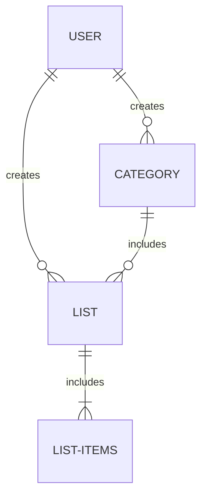
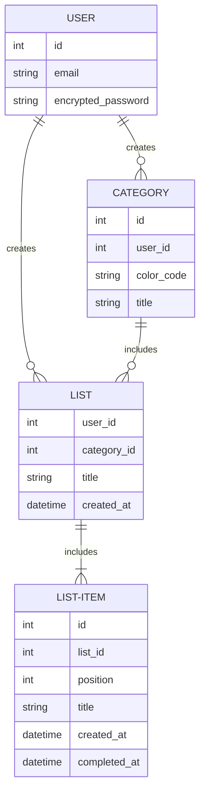

# Todo App

## Introduction

This is a simple todo app, intended to provide a way to create and categorize lists with todo items. A user can create todo items on each list with a title and status. 

## Getting Started

#### Backend with Docker compose
docker compose --profile dev up

#### Frontend UI with Vite:
npm run dev

#### Tailwind CLI compiles App.css into output.css
npx tailwindcss -i ./src/App.css -o ./src/output.css --watch

## Purpose

I need a way to create Todo lists and keep track of the items on the todo list. I would also like to group the lists by category and be able to choose a different color for each category to easily identify list types when using.

## Features

#### Must Have

- ability to create a user
- ability to create a category
- ability to create a list and assign a category
- ability to create a list_item
- ability to complete a list_item

####  Should Have

- ability to update a category
- ability to update a list
- ability to update a list_item
- ability to un-complete a list_item
- ability to delete a list_item

#### Could Have

- ability to delete a category
- ability to delete a list

#### Wish list

- ability to log in user
- ability to clone a list
- ability to archive a list

## Domain Diagram

# ERD

